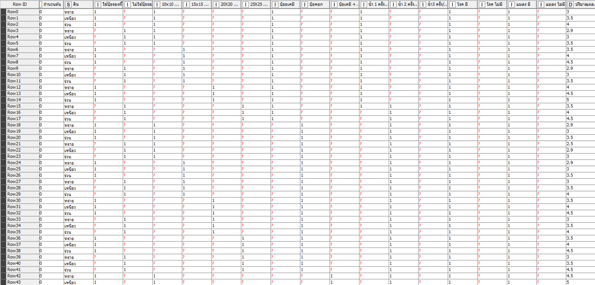
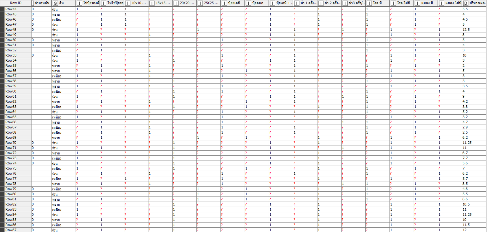
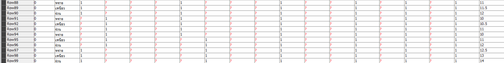
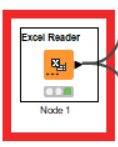
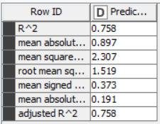
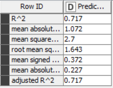

# codeless-AI-ML-2022-project
#### Excel files are used to record information within the farm, how many plots, how many trees are used in each plot, what soil is used, whether there are insects or how many crops are needed. And will use this information to make new predictions that will match the results we want or not.

## Table information

## First step to make a prediction
##### Retrieve files from Excel

##### And I try many model to make a prediction

##### But it gave me less satisfactory results.

##### For Gradient Boosted Trees Learner (Regression)

##### For simple Regression tree learner

 

In addition to the rest of the model The resulting percentage is completely negative.

until I tried another model that gave me quite a satisfactory percentage

