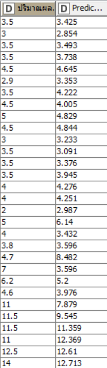

# codeless-AI-ML-2022-project
#### Excel files are used to record information within the farm, how many plots, how many trees are used in each plot, what soil is used, whether there are insects or how many crops are needed. And will use this information to make new predictions that will match the results we want or not.

## Table information

## First step to make a prediction
##### Retrieve files from Excel

##### And I try many model to make a prediction

##### But it gave me less satisfactory results.

##### For Gradient Boosted Trees Learner (Regression)

##### For simple Regression tree learner

 

In addition to the rest of the model The resulting percentage is completely negative.

until I tried another model that gave me quite a satisfactory percentage that is Gradient Boosted Trees Learner (Regression) with the addition of category to number(apply) and it gives a better result than same model that trying to make predictions at the first .

\

Result

Ex some product prediction result

## Conclusion

To predict farm yields with K nime we have tried many models. But only three models gave satisfactory results: 1) simple Regression tree learner, 2) Gradient Boosted Trees Learner (Regression), and 3) Gradient Boosted Trees Learner (Regression), with added Category to number(apply) and make model number 3 is model that give a best result 

## Author

Fitree chelong 631431007

Faosan chemama 631431008
